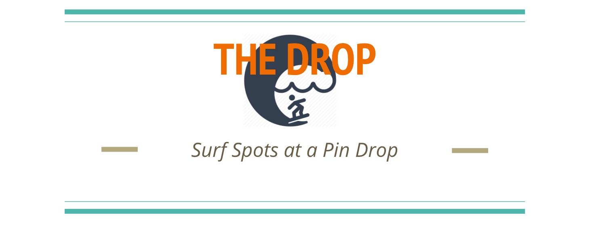
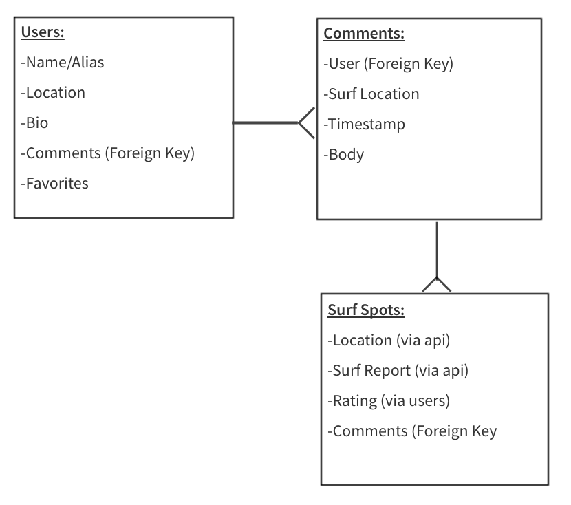
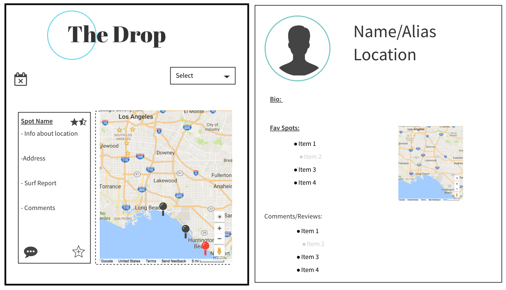

### The Drop is a full-stack application that uses both internal and outside APIs to provide users a source of surf information on Southern California Surf spots.  

Drop in Here 

#### Information about The Drop Development:

The Drop uses:
	MongoDB  

	- Express
	-  Node.js
	- Bulma
	- Session
	- Flash
	- JQuery
	- Morgan
	- Multer
	- Passport (FB & Local for Authentication)

#### Models in The Drop

	- User Model
			-- Multiple Objects withing Schema:
					Local, Facebook, Features
	- Surf Location Model
			--Location, Comments*, Rating*
	-Comment Model*
			--Belongs to both User and Surf Location

	*Not in MVP but will be added later

#### Outside APIs
[Google Maps](https://developers.google.com/maps/documentation/javascript/get-api-key)

[Surfline](https://new.surfline.com/)

[Weather Underground](https://www.wunderground.com/weather/api/)

#### UX Design Ideas

	Goals for UX:
		Clean Inteface
		Intuitive Layout and Actions
		Thematic colors and elements

#### Trello

[The Drop Trello Board](https://trello.com/b/EhADaEb6/the-drop)

#### User Stories

	-I want a surf report app so I can save surf spots I have been to or want to go to.

	-I want a surf report app that has a rating system so I can make a decision based on other surfers' experiences.

	-I want a surf report app that gives me relevant surf info like tide schedule and weather advisories.

	-I want a surf report where I can see the pages of other surfers so I can feel a part of a community.

#### Future Additions

	-Ability for users to make their own drop points

	-Ability for users to comment on surf spots, which would link back to the users account

	-More of a social platform with blog postings and such

#### Bugs

	-The outside APIs sometimes have a few bugs (mainly Google Maps)

#### Credit

[Swrobel Surf Data Git Hub](https://github.com/swrobel/meta-surf-forecast)
Google Maps
Surfline
Weather Underground
Facebook
Philippe Luchansky's OAuth Guide
